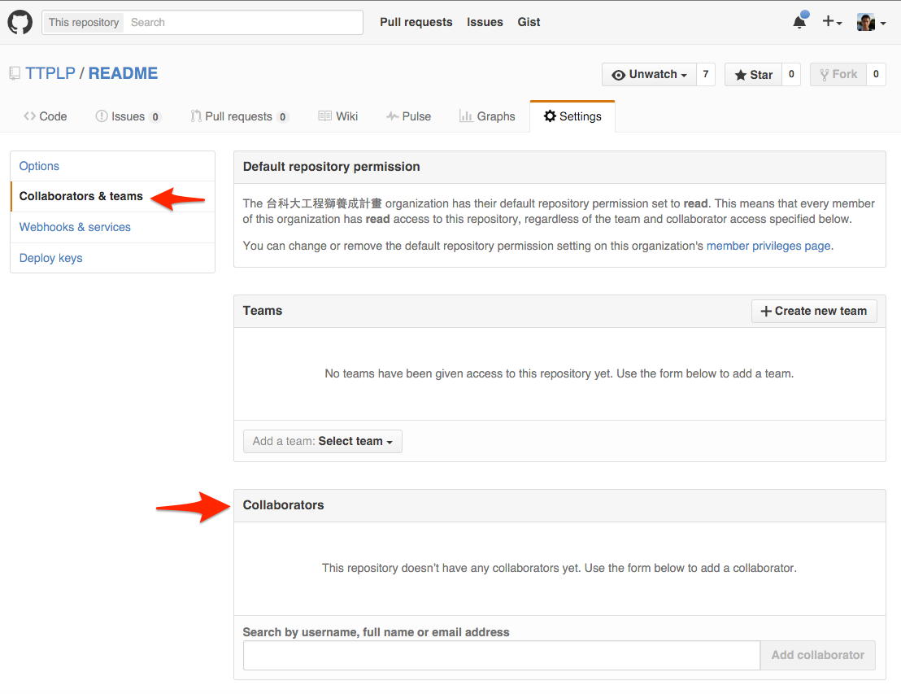

# 使用說明

這裡是讓工程獅養成計畫的學員放置專案的地方，請遵照以下規則：

- 由導師建立 Repo，並將學員設為管理者 (參考2)
- 請勿將單純練習的程式碼放入此處
- 遵守命名規則

# 命名規則

## 專案類

Project-{Project Name}-{Author Name}

範例：

- Project-Yahoo-News-Crawler-hitler11319
- Project-Guestbook-ericmina83

## 資源類

Resource-{Custom Name}

範例：

- Resource-Twitter_Client_resources

# 參考 1

預設管理者會自動關注所有的 Repo，所以會很吵，可以到自己的 Setting 頁面作如下圖設定即可解決。

# 參考 2

出於管理需求，故未開放學員建立 Repo，統一由導師建立，並將學員設為專案管理員，可以到專案的 Setting 作如下圖設定。

